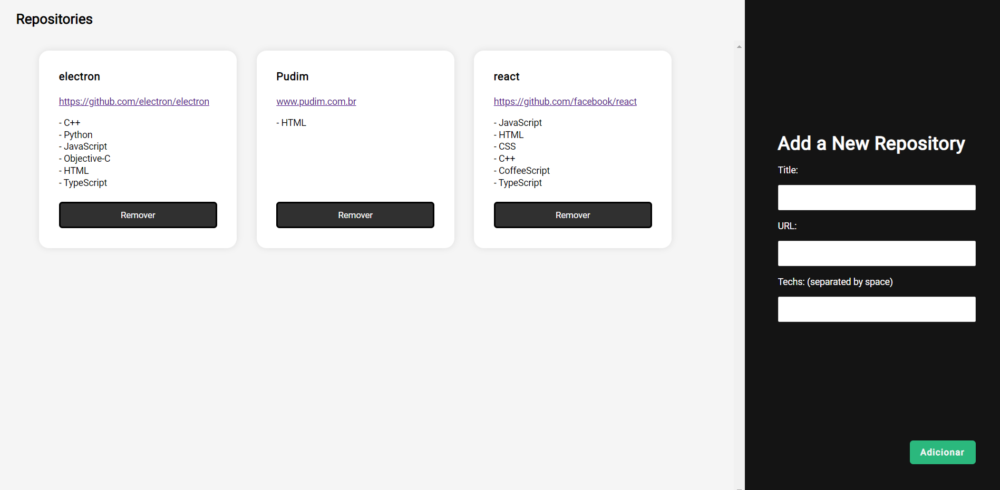

# RocketSeat NodeJS Frontend Exercise

The second exercise for the GoStack bootcamp (11th edition). A simple introductory application that follows the backend exercise providing a simple interface to display the registered data.

### Idea

This application will allow the users to visualize the data about their registered repositories. It will make simple use of JSX and flexbox CSS to layout the items.

### Tasks

Here the user should be able to:

- **`Be able to add a new repository`**: The user can add via the form (which uses basic react form handling), new data regarding the repository desired to be recorded.

- **`Be able to remove a repository`**: The user should be able to click on a "remove" button, which will remove the item from the database via `DELETE` method and have the updated server data displayed on screen.

**`NOTE`**: Buttons are in Portuguese because the tester expects them to be like that.

### Running and Testing

This application will can be executed with the command `yarn start` (if you use yarn) or `npm start` and expects the backend from the previous exercise to be running at port `3333`. To be tested via Jest.js, run the commands `yarn test` or `npm run test`. The test can be ran regardless of the previous exercise's backend.
